# ☁️ Private Self-Hosted Cloud (Raspberry Pi 5)


Private cloud infrastructure deployment using **Docker Compose**. This project eliminates reliance on third-party services (Google Drive/iCloud), ensuring **data sovereignty** and secure remote access even behind a restrictive university network (CGNAT).

<div align="center">
<table>
<tr>
<td align="center">

<br />
<em>Web Dashboard</em>
</td>
<td align="center">

<br />
<em>Remote Access (Tailscale)</em>
</td>
<td align="center">

<br />
<em>Infrastructure (Docker)</em>
</td>
</tr>
</table>
</div>

---

### 💡 The Architecture (How it works)

```mermaid
graph TD
    %% Estilos
    classDef user fill:#2c3e50,stroke:#fff,stroke-width:2px,color:white;
    classDef container fill:#0082D9,stroke:#fff,stroke-width:2px,color:white;
    classDef db fill:#e1b12c,stroke:#fff,stroke-width:2px,color:white;
    classDef vol fill:#95a5a6,stroke:#333,stroke-width:2px,stroke-dasharray: 5 5;

    subgraph World ["🌍 External World (WAN)"]
        Client["📱 Mobile / Laptop"]
    end

    subgraph RPi ["🍓 Raspberry Pi 5 (Host)"]
        Tailscale["🚇 Tailscale Interface"]
        
        subgraph Docker ["🐳 Docker Network"]
            NC["Nextcloud App"]
            MDB[("MariaDB")]
        end

        %% Persistencia
        Vol1["💾 nextcloud_data"]
        Vol2["💾 db_data"]
    end

    %% Conexiones
    Client ==>|"Encrypted Tunnel (VPN)"| Tailscale
    Tailscale -.->|"Port 8080:80"| NC
    NC <-->|"Internal DNS (db:3306)"| MDB
    
    %% Volumenes
    NC --- Vol1
    MDB --- Vol2

    %% Asignación de Clases
    class Client,Tailscale user
    class NC container
    class MDB db
    class Vol1,Vol2 vol

```



Unlike a standard installation, this system is fully containerized to be modular and resilient.

| Component | Technical Role | "Human" Description |
| --- | --- | --- |
| **Nextcloud** | `App Container` | **The House.** The visual interface. It is ephemeral: if it breaks after an update, it is destroyed and recreated in seconds without data loss. |
| **Volumes** | `Data Persistence` | **The Vault.** Reserved disk space outside the container's lifecycle. This is where the actual files and the DB reside securely. |
| **MariaDB** | `Database Service` | **The Librarian.** Indexes the location of every file. Without this service, Nextcloud would have the data but wouldn't know how to display it. |

---

### 🌍 Network & Remote Access (The Challenge)

**The Problem:**
The infrastructure is hosted in a university dorm with a strict network (**ASK4**) that enforces client isolation and blocks Port Forwarding, preventing direct access from the internet.

**The Solution (VPN Mesh):**
I implemented **Tailscale**.

* It creates an encrypted virtual private network (Overlay Network).
* Allows my mobile and laptop to access the Raspberry Pi from anywhere (4G, Campus, Cafe) as if they were on the same local network.
* **Security:** No ports are exposed to the public internet, reducing the attack surface to zero.

> **Future Roadmap:** My goal is to implement a **Cloudflare Tunnel** to allow access via a custom domain (e.g., `cloud.fran.com`) without requiring a VPN on the client device.

---

### 🛠️ Tech Stack & Configuration

Managed via **Docker Compose**.

* **Database:** MariaDB 10.6 (Optimized with `READ-COMMITTED`).
* **Hardware:** Raspberry Pi 5 (8GB RAM) + NVMe SSD (for high-speed I/O).
* **Reverse Proxy:** Traefik (Work in Progress).

#### Volume Structure (Persistence)

```yaml
volumes:
  - nextcloud_data:/var/www/html  # User Data (Photos/Docs)
  - db_data:/var/lib/mysql        # SQL Data (Indexes)

```

---

### 🚀 Installation Guide

To replicate this environment:

1. **Clone the repository:**

```bash
git clone [https://github.com/franlrs/nextcloud-rpi.git](https://github.com/franlrs/nextcloud-rpi.git)
cd nextcloud-rpi

```

2. **Security (Environment Variables):**
Rename the example file and set your secure passwords.

```bash
cp env.example .env
nano .env

```

3. **Deploy:**

```bash
docker compose up -d

```

4. **Access:**

* **Local:** `http://raspberrypi.local:8080`
* **Remote:** Via the IP assigned by Tailscale.

---

### 📄 License

Project developed by **franlrs**. Distributed under the [MIT License](LICENSE).
